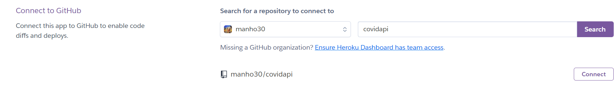

# covidapi

The PHP script for tracking the COVID-19 epidemic and vaccination data in Malaysia

Coverage percentage: 
## Usage


### Requirment
- PHP environment installed
- PHP verison 7.4 and above


### Clone the project

```bash
$ git clone https://github.com/manho30/covidapi.git
$ cd /covidapi
```

### Run the server

``` bash
$ php -S 127.0.0.1:8084
```
The server should be statr now.

### Deploy to heroku

You may deploy this project to heroku
so that everyone can use be using.

Heroku providing the free backend and sub domain 
to public

To deploy this project to Heroku, you must

- fork this project
- A Heroku account

---
1. Sing in to Heroku
2. Create a new APP
3. From `deploment method`, select `GitHub`

4. Type this project name, and select connect


**Your development should be done now**

## Credit
Open data: Ministry of Health Malaysia and CITF Malaysia
